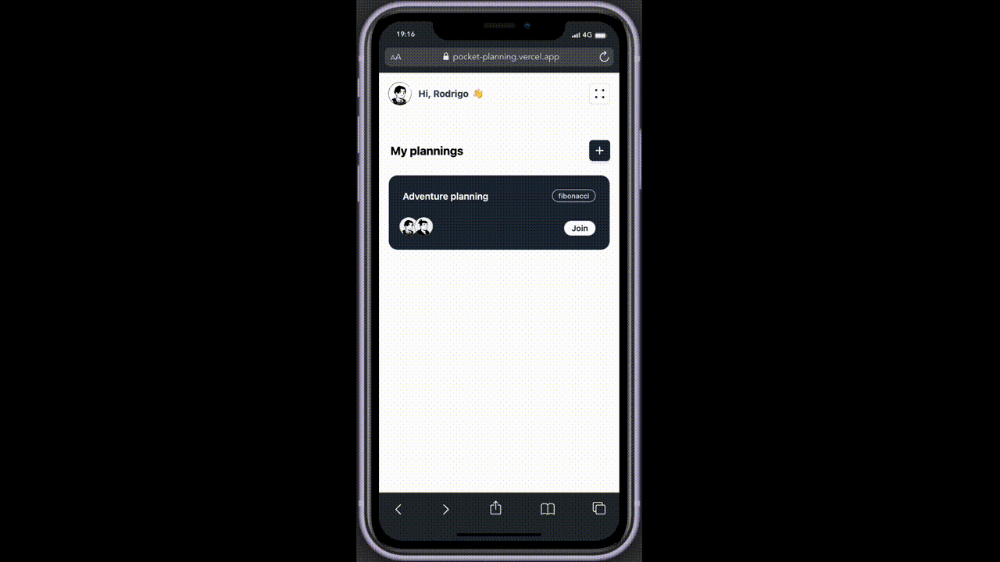
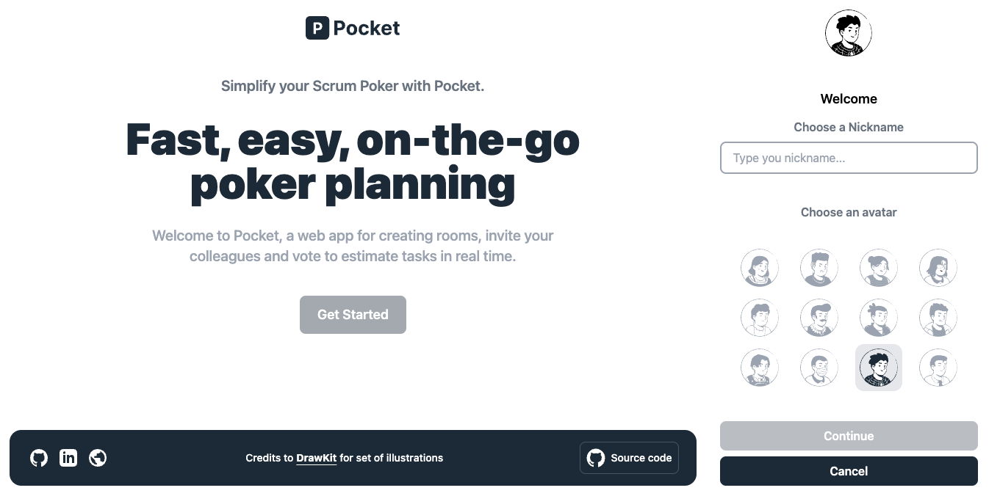

# Pocket

## Introduction

This is a web application for Agile teams to do [Scrum Poker plannings](https://asana.com/es/resources/planning-poker). You can create rooms, invite your colleagues and vote to estimate tasks in real time.

## Deployment

**See deployment**: ▶︎ [Pocket](https://pocket-planning.vercel.app/).

## Screens




## How to use

```bash
$ git clone https://github.com/rodri-alfonso/pocket.git
```

```bash
$ cd pocket
```

## Install dependencies

```bash
$ npm install
```

## Run the app

```bash
$ npm run dev
```

## Features

A list of the things you can do with Pocket:

- Create and delete a planning room and get an invitation link
- Create an avatar to identify yourself
- Expel planning participants
- Vote in realtime with others participants in a planning room

## Technologies

- [NextJS](https://nextjs.org/)
- [Tailwindcss](https://tailwindcss.com/)
- [Firebase](https://firebase.google.com/)
- [Jest](https://jestjs.io/)
- [React Testing Library](https://testing-library.com/)

## Credits

This software uses the following open source packages:

- [Notion Style Avatar Creator](https://www.drawkit.com/product/notion-style-avatar-creator)

#### Thanks to use Pocket. If you like it, give it a Github star :)
